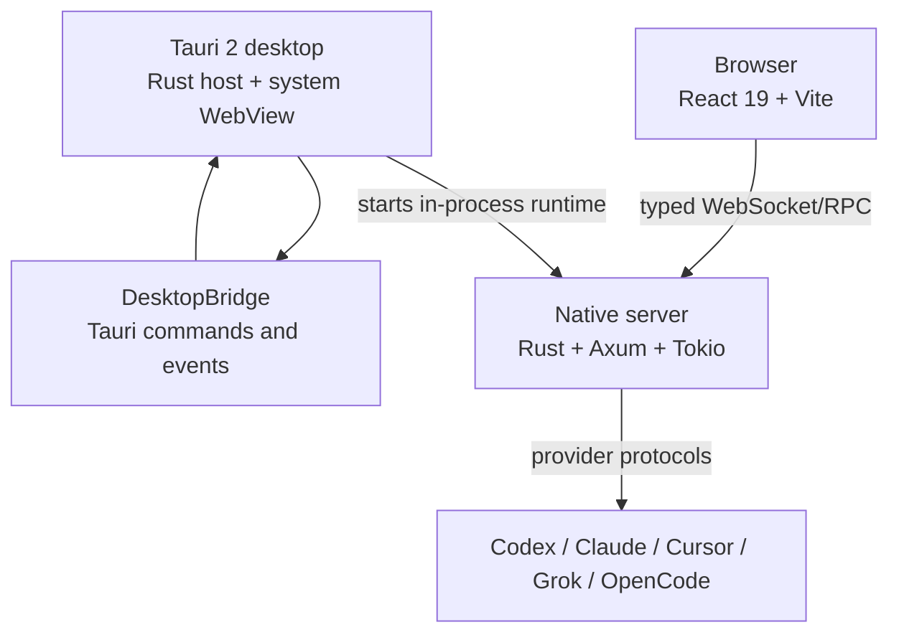
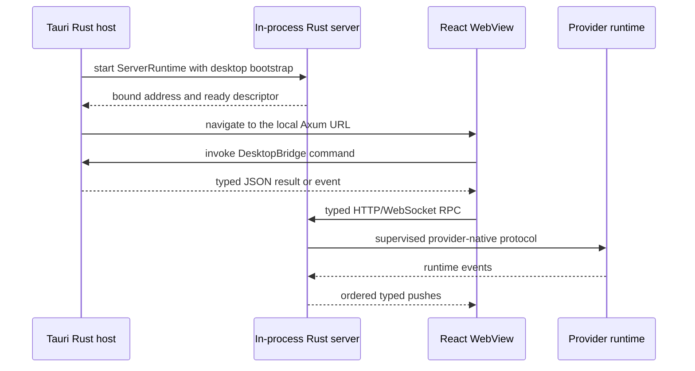

# Architecture

T4Code has one retained React/Vite frontend and one native Rust backend. Browser
mode connects to a running `t4code` server. Desktop mode runs the same frontend in
Tauri 2 and starts the Axum/Tokio server in-process. Native shell capabilities
cross a narrow `DesktopBridge`; normal application traffic uses the same typed
HTTP/WebSocket boundary in both modes.

## Components

- **Tauri host (`apps/desktop`)**: owns application/window lifecycle, native
  menus and context menus, dialogs, settings, update state, secure connection
  catalog storage, WSL/SSH preparation, in-process server lifecycle, and
  shutdown. Tauri capabilities explicitly authorize bridge commands.
- **React app (`apps/web`)**: owns all user-facing work areas and state. It uses
  hash history in desktop mode and browser history on the web. The frontend has
  no Electron dependency and uses the same components in both modes.
- **Tauri adapter (`apps/web/src/tauriDesktopBridge.ts`)**: installs
  `window.desktopBridge` only when Tauri globals are present. Native calls use
  Tauri commands/events; safe browser fallbacks cover low-risk operations.
- **Server (`apps/server`)**: a Rust library and native `t4code` binary. Axum serves HTTP and static
  assets, Tokio owns async lifecycle and bounded tasks, SQLite stores durable
  state, and Rust modules coordinate providers, terminals, Git, files,
  authentication, relay access, diagnostics, and orchestration.
- **Contracts (`packages/contracts`)**: schema-only definitions for the desktop
  bridge, WebSocket/RPC requests, push events, provider state, and persisted
  protocol values.
- **Client runtime (`packages/client-runtime`)**: environment registration,
  connection supervision, authorization, RPC sessions, caches, and client
  command construction shared by browser and desktop clients.

## Desktop Startup

The desktop host and server share one native process. The server supervises
provider CLIs, terminals, SSH forwarding, and managed relay processes with
bounded queues, cancellation, and process-tree cleanup. No Node runtime or
server sidecar is staged into desktop artifacts.

## Request And Event Flow

1. The frontend resolves an environment through the client runtime.
2. `WsTransport` opens one authenticated RPC session for that environment.
3. The server decodes requests with shared schemas and routes them to services.
4. Provider drivers translate requests into provider-native protocols.
5. Runtime ingestion normalizes provider events into orchestration events.
6. Queue-backed reactors persist and project state in order.
7. `ServerPushBus` publishes ordered typed pushes to connected clients.
8. Runtime receipts let tests and orchestration wait for completion without
   polling internal state.

## Boundaries And Invariants

- React never imports Rust or host implementation details directly.
- Native desktop functionality crosses only `DesktopBridge` commands/events.
- Normal application traffic remains WebSocket/RPC, including in desktop mode.
- `packages/contracts` contains schemas and types only.
- Rust owns all production backend behavior. TypeScript remains in the React
  frontend, shared schemas/client runtime, relay infrastructure, and build/test
  tooling only.
- Production code must not fall back to Node.js, Electron, or a TypeScript
  server when native functionality is unavailable.
- Preview and preview automation are capability-driven and use the Tauri/native
  implementation, never Electron WebContents APIs.

## Performance

The migration preserves the mature React frontend while removing both the
bundled Chromium/Electron shell and the Node server process. See
[Desktop Performance Baseline](./desktop-performance-baseline.md) for methods,
raw snapshots, and remaining cross-platform measurements.
